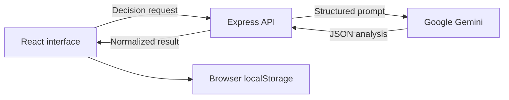

# The Tie Breaker — AI-Powered Decision Assistant

**When the choice isn't obvious, make the trade-offs visible.**

The Tie Breaker is a full-stack decision-support web app that uses Google Gemini to turn an open-ended dilemma into a structured analysis. Users can compare two to five alternatives through weighted criteria, pros and cons, per-option SWOT analyses, blind spots, and an AI-generated recommendation with an action plan.

The app is designed to support reflection—not to make important decisions on the user's behalf.

[Try the live demo](https://the-tiebreaker-7741.ai.studio) · [View the repository](https://github.com/MiguelGG14/The-Tie-Breaker-AI-Powered-Decision-Assistant)

## Features

- **Two input modes:** describe a dilemma in natural language or enter 2–5 alternatives, priorities, context, and constraints in a structured form.
- **AI-assisted option discovery:** extract options and suggested priorities from a broad dilemma before running the full analysis.
- **Multi-angle analysis:** generate impact-rated pros and cons, a SWOT breakdown for each option, and hidden risks with possible mitigations.
- **Editable weighted matrix:** review AI-generated criteria, change their importance, edit option scores, and add or remove criteria. Rankings update in the browser.
- **Tiebreaker verdict:** receive a recommended option, confidence score, deciding factor, critical trade-off, action plan, and conditions that could justify choosing another option.
- **What-if sandbox:** test a changed assumption and see whether it shifts the recommendation or confidence score without overwriting the original analysis.
- **Gut check:** reveal a random option and record the user's immediate reaction as an intuition prompt.
- **Local decision history:** save, reopen, search, filter, and delete analyses stored in the current browser.
- **Export options:** copy a Markdown report, download the analysis as JSON, or use the browser's print dialog to save a PDF.
- **Decision presets:** start from included career, housing, technology, product, relocation, and vehicle examples.

## How It Works

1. Enter a free-form dilemma, or switch to the structured form and define the alternatives yourself.
2. Optionally provide priorities, constraints, and background context.
3. The Express server sends the request to Gemini and asks for a structured JSON response.
4. The React dashboard presents the verdict, pros and cons, SWOT analysis, comparison criteria, and blind spots.
5. Adjust the matrix or supporting factors, test a what-if scenario, and export or save the result locally.



The Gemini API key is used only by the server. It is not exposed through a `VITE_` environment variable or shipped in the client bundle.

## Tech Stack

| Area | Technology |
| --- | --- |
| Frontend | React 19, TypeScript, Vite 6 |
| Styling | Tailwind CSS 4, custom CSS |
| UI and motion | Lucide React, Motion, canvas-confetti |
| Backend | Express 4, TypeScript |
| AI | Google Gen AI SDK (`@google/genai`) using `gemini-3.7-flash` |
| Persistence | Browser `localStorage` |
| Build | Vite and esbuild |
| Deployment target | Node.js server; currently deployed through Google AI Studio/Cloud Run |

## Getting Started

### Prerequisites

- Node.js 20 or newer
- npm, or Bun if you prefer to use the committed `bun.lock`
- A Gemini API key from [Google AI Studio](https://aistudio.google.com/app/apikey)

### Installation

```bash
git clone https://github.com/MiguelGG14/The-Tie-Breaker-AI-Powered-Decision-Assistant.git
cd The-Tie-Breaker-AI-Powered-Decision-Assistant
npm install
```

You can use `bun install` instead of `npm install`.

Create a local environment file from the example:

```bash
cp .env.example .env
```

Then replace the placeholder value in `.env`:

```dotenv
GEMINI_API_KEY="your_gemini_api_key"
```

On Windows PowerShell, the copy command is:

```powershell
Copy-Item .env.example .env
```

### Run in Development

```bash
npm run dev
```

Open [http://localhost:3000](http://localhost:3000). The development command starts Express and mounts Vite as middleware, so both the UI and API are available from the same server.

### Type-Check and Build

```bash
npm run lint
npm run build
```

Despite the script name, `npm run lint` currently runs TypeScript type-checking with `tsc --noEmit`; it does not run ESLint.

The build command creates the frontend bundle and the bundled server in `dist/`.

### Run the Production Build

Set `NODE_ENV=production`, then start the compiled Express server:

```bash
NODE_ENV=production npm start
```

PowerShell equivalent:

```powershell
$env:NODE_ENV = "production"
npm start
```

The server listens on port `3000`. `npm run preview` starts Vite's frontend-only preview server, so AI requests will not work there unless an API server is provided separately.

## Environment Variables

| Variable | Required | Purpose |
| --- | --- | --- |
| `GEMINI_API_KEY` | Yes | Authenticates server-side requests to Gemini. |
| `APP_URL` | No | AI Studio/Cloud Run deployment metadata included in `.env.example`. The current application code does not read it during local execution. |
| `NODE_ENV` | For production | Use `production` so Express serves the built files from `dist/`. |

Do not commit `.env` or expose the Gemini API key in client-side code.

## API Routes

| Method | Route | Purpose |
| --- | --- | --- |
| `GET` | `/api/health` | Basic server health response. |
| `POST` | `/api/brainstorm-options` | Turns a broad dilemma into 2–4 options and suggested priorities. |
| `POST` | `/api/analyze` | Generates the complete decision analysis. |
| `POST` | `/api/tweak-scenario` | Re-evaluates the verdict under a hypothetical change. |

## Project Structure

```text
.
├── server.ts                    # Express server, Gemini prompts, and API routes
├── src/
│   ├── App.tsx                  # Application state and API orchestration
│   ├── components/              # Input, dashboard, analysis, history, and export UI
│   ├── data/presets.ts          # Built-in example decisions
│   ├── utils/scoring.ts         # Client-side weighted-score calculations
│   ├── utils/storage.ts         # Browser localStorage persistence
│   └── types.ts                 # Shared decision-analysis types
├── vite.config.ts               # React, Tailwind, aliases, and dev-server settings
├── tsconfig.json                # TypeScript configuration
├── .env.example                 # Environment variable template
└── package.json                 # Scripts and dependencies
```

## Limitations and Disclaimer

- AI-generated analysis can be incomplete, inconsistent, or incorrect. Review the assumptions and verify important facts independently.
- This project is a reflection and comparison tool, not financial, legal, medical, mental-health, or other professional advice.
- Decision history is stored only in the current browser. There are no user accounts, database, cloud sync, or cross-device recovery.
- Dilemma text, context, options, priorities, and scenario prompts are sent from the server to the configured Gemini API. Review Google's applicable privacy and data-handling terms before entering sensitive information.
- The app depends on Gemini model availability, quota, latency, and API pricing. The model name is currently fixed in `server.ts`.
- The confidence score is generated by the model; it is not a statistically calibrated probability.
- What-if results are displayed separately and do not rewrite the saved comparison matrix or original verdict.
- PDF export uses the browser print dialog rather than a dedicated PDF renderer.

## Roadmap

- Add runtime schema validation and more resilient handling of malformed or partial model responses.
- Add automated tests for API normalization, scoring, storage, and key user flows.
- Make the model, server port, and analysis depth configurable.
- Improve accessibility and print-specific styling.
- Add optional accounts and encrypted cloud sync while keeping local-only use available.

## Contributing

Issues and focused pull requests are welcome. If a change affects the generated analysis shape, update both the server response schema and the TypeScript types used by the dashboard.

---

Built as a portfolio project exploring how generative AI can make complex trade-offs easier to inspect—not how it can replace human judgment.
